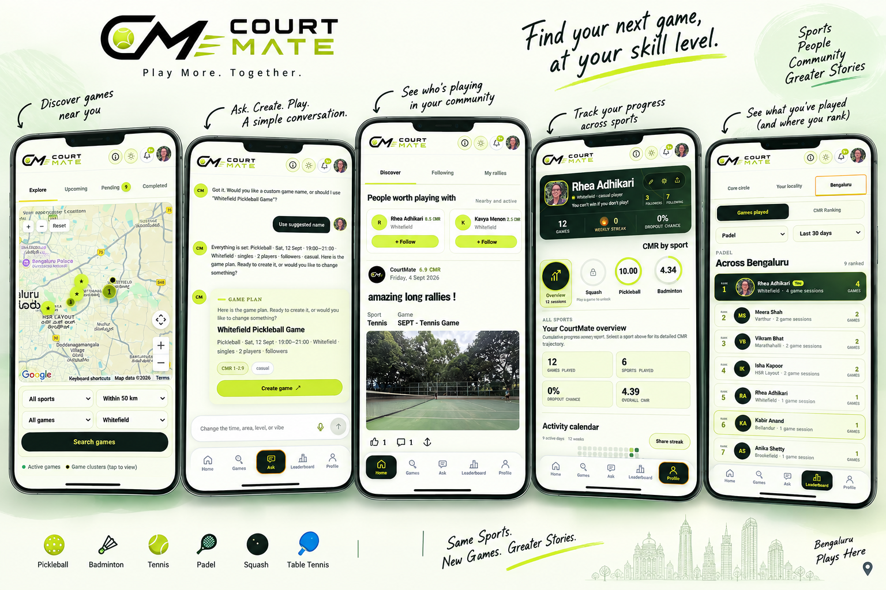

# CourtMate

**Play more. Together.** Find your next racket-sports game, at your skill level.

[Live app](https://court-mate-blr.vercel.app/) · [Technical blog](https://medium.com/@rheadhikari/building-courtmate-ai-powered-game-discovery-with-google-cloud-45ae1087f1a3) · [Watch the demo](https://drive.google.com/file/d/1AeZK6aqI5kf2KhtlqPSF2UzbttQXqYQC/view?usp=drive_link) · [Technical PDF](docs/CourtMate%20Tech%20Doc.pdf)



CourtMate connects discovery, coordination, and progression for **pickleball,
badminton, tennis, padel, squash, and table tennis**. Ask for a game in everyday
language, organise a session, and keep your sports community in one place.

## Table of contents

- [The experience](#the-experience)
- [Architecture](#architecture)
- [AI and matching](#ai-and-matching)
- [Quick start](#quick-start)
- [Project structure](#project-structure)
- [Testing](#testing)
- [Deployment and documentation](#deployment-and-documentation)

## The experience

> "Find a badminton game near Whitefield tomorrow evening."

| Area | What you can do |
| --- | --- |
| **Ask CourtMate** | Find or create games through guided conversation and ask about stored performance history. |
| **Explore** | Discover games on a map; filter by sport, area, schedule, and skill. |
| **Games** | Manage upcoming sessions, join requests, waitlists, and completed games. |
| **Rally Circles** | Coordinate each game's lineup, chat, check-ins, and feedback in a shared workspace. |
| **Progression** | Track sport-specific CMR, activity, and participation reliability. |
| **Community** | Follow players, share posts, receive notifications, and compare CMR or games-played rankings. |

**Discover → Join or create → Coordinate → Play → Give feedback → Track progress**

CourtMate Rating (CMR) represents skill on a **1.00–10.00 scale for each sport**.
Updates depend on the game's rating mode and eligible feedback or results.
Participation reliability is tracked separately.

## Architecture

| Layer | Technology | Responsibility |
| --- | --- | --- |
| Web | Next.js 16 · React 19 · TypeScript | Responsive UI and conversational workflows |
| Identity | Firebase Authentication | Google sign-in and Firebase ID tokens |
| API | Python · FastAPI · Cloud Run | Authorization, matching, validation, and game lifecycle |
| Database | Firestore | Authoritative application records and vector retrieval |
| Media | Cloud Storage | Profile photos, game posts, and supported activity evidence |
| Location | Google Maps Platform | Interactive maps and locality geocoding |
| AI | Gemini · Vertex AI | Intent interpretation and embeddings |

The frontend is hosted on Vercel and sends ID tokens with authenticated API
requests. FastAPI verifies identity, checks permissions, and applies business
rules before reading or writing records and returning a structured response.

## AI and matching

**AI interprets the request; the backend decides which results are eligible.**

1. Extract sport, area, date, and time from the conversation.
2. Retrieve candidates through deterministic matching and optional semantic search.
3. Re-read authoritative records and check visibility, availability, capacity,
   and compatibility before returning results.
4. For game creation, collect required details and confirm the plan before
   submitting it through the game API.

Core matching works without Gemini. Model-based intent parsing requires
`COURTMATE_USE_GEMINI_INTENT=true` and a configured model client. Vertex AI
embeddings and the Firestore vector index are optional; unavailable semantic
retrieval falls back to deterministic matching.

## Quick start

**Prerequisites:** Python 3.12; Node.js 20.9+ for the website.
Commands use Bash on macOS, Linux, or WSL.

### Backend without cloud credentials

```bash
git clone https://github.com/RheaAdh/CourtMate.git
cd CourtMate
python3 -m venv .venv
source .venv/bin/activate
python -m pip install -r requirements.txt
python -m pytest -q
```

Start an empty, temporary local API:

```bash
COURTMATE_DATASTORE=memory \
COURTMATE_AUTH_REQUIRED=false \
COURTMATE_USE_VERTEX_AI=false \
GOOGLE_GENAI_USE_VERTEXAI=false \
COURTMATE_USE_GEMINI_INTENT=false \
COURTMATE_GROUNDED_RESPONSE_WITH_GEMINI=false \
COURTMATE_VECTOR_SEARCH_ENABLED=false \
GEMINI_API_KEY= GOOGLE_MAPS_API_KEY= \
python -m uvicorn backend.main:app --host 127.0.0.1 --port 8000
```

Open [API docs](http://127.0.0.1:8000/docs) or
[health](http://127.0.0.1:8000/health). Local development uses the
`X-CourtMate-Player-ID` header to simulate players and clears data on restart.
Keep authentication enabled for public deployments.

Try the [two-player API walkthrough](docs/setup-and-evaluation.md#manual-api-walkthrough)
to create a game, request a place, approve it, and exchange a message.

### Full web application

Create local configuration files, then fill in Firebase and backend settings
using the [browser setup guide](docs/setup-and-evaluation.md#browser-evaluation-with-google-sign-in):

```bash
test -f .env || cp .env.example .env
test -f .env.local || cp .env.local.example .env.local
npm ci
npm run dev
```

The website opens at [localhost:3000](http://localhost:3000) and expects the API at
`http://localhost:8000`. The guide covers API startup, Firebase Google sign-in,
Firestore, and backend credentials. The website requires sign-in even when
the API supports development headers.

Server settings belong in `.env`; browser configuration belongs in
`.env.local`. Never place server secrets in `NEXT_PUBLIC_*` variables.

## Project structure

| Source | Purpose |
| --- | --- |
| [app/page.tsx](app/page.tsx) | Main application and Ask workflows |
| [app/community-hub.tsx](app/community-hub.tsx) | Community map and discovery |
| [app/group-space.tsx](app/group-space.tsx) | Session workspace and chat |
| [app/social-feed.tsx](app/social-feed.tsx) | Posts and player connections |
| [backend/main.py](backend/main.py) | API routes and application orchestration |
| [backend/auth.py](backend/auth.py) | Firebase token verification |
| [backend/models.py](backend/models.py) | Schemas and rating models |
| [backend/matching.py](backend/matching.py) | Game and replacement ranking |
| [backend/repository.py](backend/repository.py) | Firestore and in-memory persistence |
| [backend/gemini.py](backend/gemini.py) | Intent parsing and AI adapters |
| [backend/vector_search.py](backend/vector_search.py) | Embeddings and semantic retrieval |
| [tests/](tests/) | API and matching regression tests |

## Testing

```bash
python -m pytest -q
npm run lint
npm run typecheck
npm run build
```

Backend tests use synthetic records and in-memory storage. Frontend checks cover
lint, types, and production compilation. Real sign-in, media uploads, and
multi-user interactions need separate browser validation.

See the [evaluation checklist](docs/setup-and-evaluation.md#evaluation-checklist).
No browser end-to-end suite or automatic CI workflow is currently configured.

## Deployment and documentation

| Guide | Details |
| --- | --- |
| [Setup and evaluation](docs/setup-and-evaluation.md) | Complete setup, two-player walkthrough, and troubleshooting |
| [Configuration](docs/setup-and-evaluation.md#configuration) | Environment variables and optional integrations |
| [Semantic search](docs/setup-and-evaluation.md#grounded-semantic-search) | Embedding corpus and Firestore vector index |
| [Deployment](docs/setup-and-evaluation.md#deployment) | Vercel, Cloud Run, and authentication configuration |
| [Docker](docs/setup-and-evaluation.md#docker) | Backend container build and health check |
| [Demo data and migrations](docs/setup-and-evaluation.md#demo-data-and-migrations) | Synthetic Firestore records and historic CMR conversion |
| [Technical document](docs/CourtMate%20Tech%20Doc.pdf) | Project design and implementation context |
| [Behind the build](https://medium.com/@rheadhikari/building-courtmate-ai-powered-game-discovery-with-google-cloud-45ae1087f1a3) | The problem, implementation approach, and Google Cloud architecture |

The API exposes interactive OpenAPI documentation at `/docs` when running.
